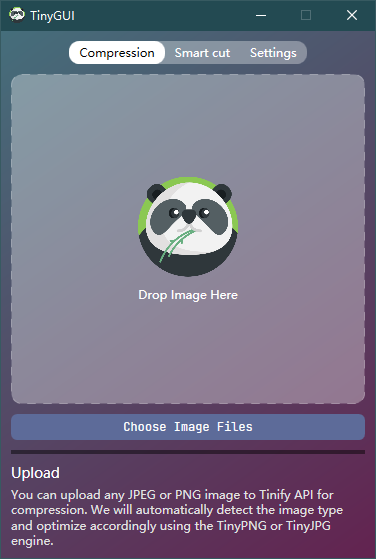

# TinyGUI

TinyGUI is a visual implementation of TinyPNG that helps you compress images quickly. If you want to use TinyGUI to compress WebP, PNG or JPEG images, please go to https://tinypng.com/developers to get an API Key for free. Installation package download address: http://www.redisant.com/#Family

TinyGUI是TinyPNG的可视化实现，帮助你快速压缩图片。如果你想使用TinyGUI压缩WebP、PNG 或 JPEG图片，请先去 https://tinypng.com/developers 免费获取一个API Key。安装包下载地址：http://www.redisant.cn/#Family

TinyGUI ist eine visuelle Implementierung von TinyPNG, mit der Sie Bilder schnell komprimieren können. Wenn Sie TinyGUI zum Komprimieren von WebP-, PNG- oder JPEG-Bildern verwenden möchten, gehen Sie bitte zu https://tinypng.com/developers, um kostenlos einen API-Schlüssel zu erhalten. Download-Adresse des Installationspakets: http://www.redisant.com/#Family